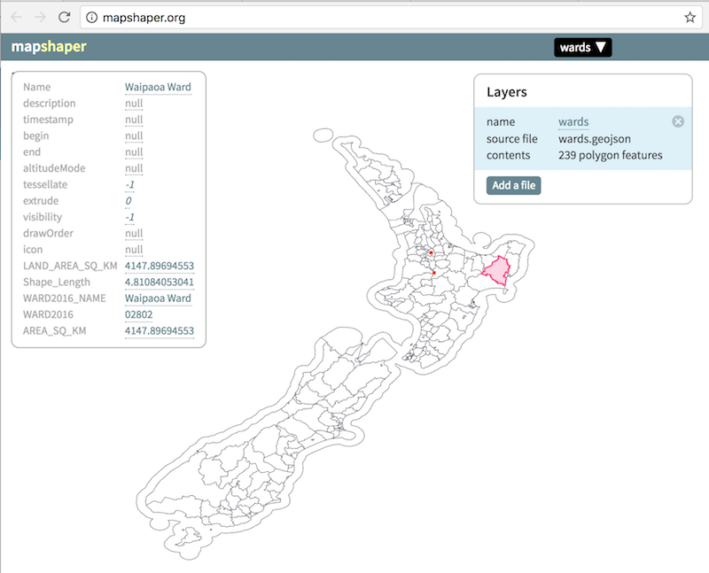

Steps followed
====================

1/ download the dataset
---------------------

You can use  https://data.govt.nz/ to look for datasets. For instance, if you look for wards, you will find https://data.govt.nz/dataset/show/5531, which will redirect you to https://datafinder.stats.govt.nz/layer/8406-ward-2016-generalised-version/

How to download is not necessarily obvious. Click on the 3 vertical dot to pop a menu with a download option.

Choose a format that you can easily convert. Popular options are kml, shp, geojson.

Most web-browser compatible mapping tools accept a very limited number of geographic formats. Most are fine with geojson. If your file is in kml or shp format, it is likely that you will have to convert it first.

2/ Familiarize yourself with tools that can convert data.
---------------------

### 2a/ Use online tools

If you don't want to install any specialist GIS tools on your machine, the easiest is to use http://mapshaper.org/.

Unfortunately, it does not accept the kml format. You have to use an online converter first (https://mygeodata.cloud/converter/kml-to-geojson).

### 2b/ Install specialist GIS tools on your machine

#### a/ GDAL

Go to http://www.kyngchaos.com/software/frameworks and install the Unix Compatibility Frameworks in this order:

* GDAL Complete
* GSL framework
* FreeType
* cairo

#### b/ topojson utilities

If you are plotting your data with d3js, consider using [topojson](https://github.com/topojson/topojson). TopoJSON is an extension of GeoJSON that encodes topology in a more compact format.

Presuming that nodejs is already installed on your machine (https://nodejs.org/en/download/), from the command line:

* npm install -g topojson
* npm install -g topojson-simplify

3/ Convert the dataset to a format compatible with popular browser based mapping tools.
---------------------

### 3a/ Convert to geojson

    ogr2ogr  -f "GeoJSON" -t_srs crs:84 ward-2016-generalised-version.kml
    ogr2ogr  -f "GeoJSON" -t_srs crs:84 germany.json vg250_L.shp

### 3b/ If you are plotting your data with d3js, consider converting to topojson

   geo2topo germany.geojson > germany.topojson

### 4b/ Reduce the size of your file

You can use the Mapshaper website, click on the simplify button. Then choose export.

Or you can use `toposimplify` on the command line.

   toposimplify -f -p 0.01 < germany.topojson  > germany-s.topojson

4/ Plot your data
---------------------

Different options exist: d3js, leaflet, googlemap, cartoDB.

The simplest is to use d3js. For instance:

    var w = 1200, h = 800;
    var mapProjection = d3.geo.mercator().center([14.5,52.5]).scale(3000);
    var pathGenerator = d3.geo.path().mapProjection(mapProjection);

    //Create SVG element
    var svg = d3.select("body")
                .append("svg")
                .attr("width", w)
                .attr("height", h);

    // Note the slight variations when using geojson vs topojson
    var fmt = "topojson";
    //Load in Topology data
    d3.json(fmt === "geojson" ? "germany.geojson" : "germany.topojson", function(json) {

        //Bind data and create one path per GeoJSON feature
        svg.selectAll("path")
           // .data(json.features)
           .data((fmt === "geojson" ? json :  topojson.feature(json, json.objects.germany)).features)
           .enter()
           .append("path")
           .attr("d", pathGenerator);
    });

Finding the centroid can be quite challenging, with a geojson file, you can use

  function findTheCentroid(topology, w, h) {
    var scale = 2000;
    var offset = [250, 454.39346517537];
    var project, path;

    var center = d3.geo.centroid(topology);

    if(!isNaN(center[0])) {

      //Define map projection
      projection = d3.geo.mercator().center(center).scale(scale);
      //Define path generator
      path = d3.geo.path().projection(projection);

      var bounds  = path.bounds(topology);
      var hscale  = scale*w  / (bounds[1][0] - bounds[0][0]);
      var vscale  = scale*h / (bounds[1][1] - bounds[0][1]);
      scale   = (hscale < vscale) ? hscale : vscale;
      offset  = [w - (bounds[0][0] + bounds[1][0])/2,
                        h - (bounds[0][1] + bounds[1][1])/2];
    } else {
      center = [173.30113805495805, -41.39041654133352];
    }

    projection = d3.geo.mercator().center(center).scale(scale).translate(offset);
    path = d3.geo.path().projection(projection);

    return path;
  }

Open index.html in a browser, for an example. Because we load data, we will need to run with a server. On a mac, you can double click on `server.command` to launch it. Alternatively, from the command line `python -m http.server`.
